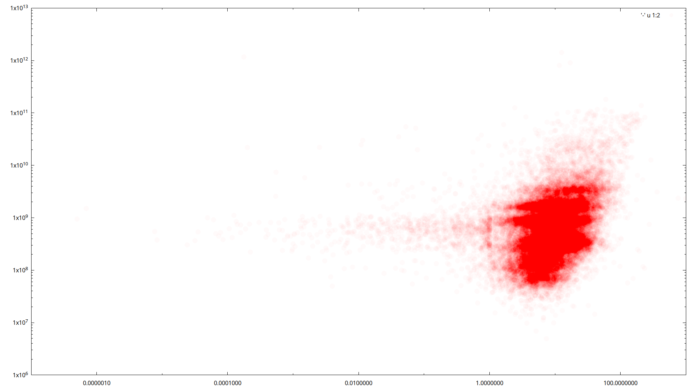

### qbtlib.sh

#### ratio-size plot

```bash
$ qbtlib.sh stat.png
-rw-r--r-- 1 yekm yekm 200K Mar 20 14:41 /tmp/qbtlib-stat-ratio-size-2025-03-20_14:41.png
```




#### spark

Store lies like `localhost:8283  1742471029      40.46412181854248       0` into
temp file (`/tmp/qbtlib_speedhistory.log)

```bash
$ systemd-run --user -E PATH --on-calendar=minutely -- bash qbtlib.sh appendspeedhistory
```

After some time
```bash
$ qbtlib.sh sparkhistory
42 max    / min    16:10                                      14:51
ul  62.501/ 55.300 ▃▄▆▅▂▅▆▄▅▆▆█▅▅▁▅▇▆▅▄▃▂▃▇▇▅▃█▆▅▂▅▅▆▅▆▄▅▆▆▆▅ 15:27 
dl   0.000/  0.000 ▁▁▁▁▁▁▁▁▁▁▁▁▁▁▁▁▁▁▁▁▁▁▁▁▁▁▁▁▁▁▁▁▁▁▁▁▁▁▁▁▁▁ 15:27 
```

### rtrckr.sh

#### xml2tsv

```bash
$ time rtrckr.sh xml2tsv
      xml: 25.6GiB 0:03:50 [ 113MiB/s] ( 113MiB/s)
 filtered: 1.03GiB 0:04:14 [4.15MiB/s] (4.15MiB/s)
      tsv:  810MiB 0:04:14 [3.18MiB/s] (3.18MiB/s)

real    4m14.719s
user    5m2.519s
sys     1m24.378s

$ head -n2 rtrckr/rtrckr.tsv
19560   2005.12.26 21:16:00     121752437       (Православная музыка) Хор Саввино-Сторожевского монастыря       1629C79994C318FE79BCB3C805C4287AC7680F84        fid:1396        Музыка - Классическая и современная академическая музыка - Духовные песнопения и музыка (lossy)
20850   2006.01.13 19:59:00     172516131       (Православная? музыка) Песнопения Иеромонаха Романа - Слава Богу, снова я один  EA37337FF58886336DF93EB90687BBD5F5789BD4        fid:1396        Музыка - Классическая и современная академическая музыка - Духовные песнопения и музыка (lossy)
```

#### rutracker fs

creates directories-symlinks filesystem tree that repeats
rutracker's forum-topic structure:
`forum / <forum-name> / <topic-name> / <symlink-to-qbt's-content-path>`

```bash
$ time rtrckr.sh rtrckrfs
maxname is 512
reading cache from qbt: 1.12MiB 0:00:01 [ 832KiB/s] ( 832KiB/s)
writing cache to tsv: 10.8MiB 0:00:25 [ 436KiB/s] ( 436KiB/s)
filtering hashes from tsv: 4.02KiB 0:00:01 [4.02KiB/s] (4.02KiB/s)
reading cache from qbt: 3.28MiB 0:01:17 [43.1KiB/s] (43.1KiB/s)parallel: Warning: Reading 3753 arguments took longer than 10 seconds.
filtering hashes from tsv: 10.6MiB 0:01:18 [ 138KiB/s] ( 138KiB/s)

Computers / CPU threads / Max jobs to run
1:local / 24 / 12

Computer:jobs running/jobs completed/%of started jobs/Average seconds to complete
ETA: 0s Left: 0 AVG: 0.00s  local:0/28576/100%/0.0s

real    3m43.712s
user    7m44.765s
sys     6m20.373s

$ tree forum | head
forum
├── Hi-Res форматы, оцифровки - Hi-Res stereo и многоканальная музыка - Джаз и Блюз (Hi-Res stereo)
│   └── [TR24][OF][Nu Jazz][Jazz-Rock] The Comet Is Coming — "Death to the Planet" (EP) — 2017
│       └── The Comet Is Coming - Death to the Planet - 2017 (web, 24bit) -> ../../../VS/05.Agreetor/The Comet Is Coming - Death to the Planet - 2017 (web, 24bit)
├── Hi-Res форматы, оцифровки - Hi-Res stereo и многоканальная музыка - Классика и классика в современной обработке (Hi-Res stereo)
│   ├── [TR24][OF] Beethoven - Symphony No. 5 - Teodor Currentzis, MusicAeterna - 2020 (Classical)
│   │   └── Teodor Currentzis - Beethoven_Symphony No. 5 (2020) [24-96] -> ../../../MusicAeterna/Teodor Currentzis - Beethoven_Symphony No. 5 (2020) [24-96]
│   ├── [TR24][OF] Beethoven - Symphony No. 7 in A Major, Op. 92 - Teodor Currentzis, MusicAeterna - 2021 (Classical)
│   │   └── Teodor Currentzis - Beethoven_Symphony No. 7 in A Major, Op. 92 (2021) [24-96] -> ../../../MusicAeterna/Teodor Currentzis - Beethoven_Symphony No. 7 in A Major, Op. 92 (2021) [24-96]
│   ├── [TR24][OF] Mahler - Symphony No. 6 - MusicAeterna, Teodor Currentzis - 2018 (Classical)
```

#### forums stats

```bash
$ time rtrckr.sh grep | cut -f7 | sed 's/ - .*//' | sort -u | parallel -j8 --tag 'rtrckr.sh grep {} | cut -f3 | qbtlib.sh sum | qbtlib.sh bytes' | sort -t$'\t' -k2 -n | qbtlib.sh table
ОБХОД БЛОКИРОВОК                      7425136 bytes = 7.425136 MB
Приватные форумы                      1016175361 bytes = 1.016175361 GB
Товары, услуги, игры и развлечения    11306237365 bytes ≈ 11.30623737 GB
Обсуждения, встречи, общение          150729806777 bytes ≈ 150.7298068 GB
Новости                               2519629753758 bytes ≈ 2.519629754 TB
Мобильные устройства                  11933210154403 bytes ≈ 11.93321015 TB
Обучение иностранным языкам           21623488373318 bytes ≈ 21.62348837 TB
Популярная музыка                     41400297749069 bytes ≈ 41.40029775 TB
Джазовая и Блюзовая музыка            45986801673551 bytes ≈ 45.98680167 TB
Аудиокниги                            50850836014954 bytes ≈ 50.85083601 TB
Авто и мото                           64228555953567 bytes ≈ 64.22855595 TB
Apple                                 89656255715413 bytes ≈ 89.65625572 TB
Разное                                113281863114340 bytes ≈ 113.2818631 TB
Книги и журналы                       126302674158245 bytes ≈ 126.3026742 TB
Электронная музыка                    136826402865164 bytes ≈ 136.8264029 TB
Обучающее видео                       193744335233714 bytes ≈ 193.7443352 TB
Hi-Res форматы, оцифровки             227222257381079 bytes ≈ 227.2222574 TB
Рок-музыка                            234190157220224 bytes ≈ 234.1901572 TB
Программы и Дизайн                    260674279726586 bytes ≈ 260.6742797 TB
Документалистика и юмор               287244101624892 bytes ≈ 287.2441016 TB
Музыкальное видео                     405176337822247 bytes ≈ 405.1763378 TB
Игры                                  438363766109631 bytes ≈ 438.3637661 TB
Спорт                                 1097509149827821 bytes ≈ 1.097509150 PB
Музыка                                1109010330867751 bytes ≈ 1.109010331 PB
Сериалы                               1157939242386441 bytes ≈ 1.157939242 PB
Кино, Видео и ТВ                      2012140607650737 bytes ≈ 2.012140608 PB

real    0m27.854s
user    5m15.413s
sys     5m35.537s
```


### fun

Total created processes:
```bash
# content path of active torrents by top 4 coutries
$ time strace -e none -ff bash -c "qbtlib.sh active | cut -f1 | qbtlib.sh countries | qbtlib.sh rawtop | tail -n4 | parallel qbtlib.sh tcountries | parallel -k --tag --colsep=$'\t' 'qbtlib.sh cpath {1}' | cut -f2- -d' ' | column -t -s$'\t' " |& grep Process | grep attached | wc -l
5119

real    0m9.924s
user    0m16.649s
sys     0m19.255s

# files from top 10 peers
$ time strace -e none -ff bash -c "qbtlib.sh active | cut -f1 | qbtlib.sh connections | qbtlib.sh rawtop | tail -n10 | qbtlib.sh peerfiles" |& grep Process | grep attached | wc -l
11121

real    0m24.237s
user    0m39.619s
sys     0m53.063s
```
